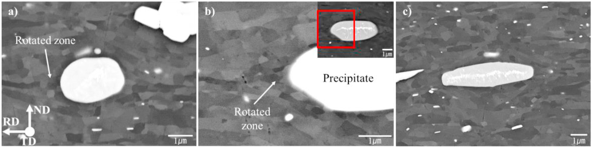
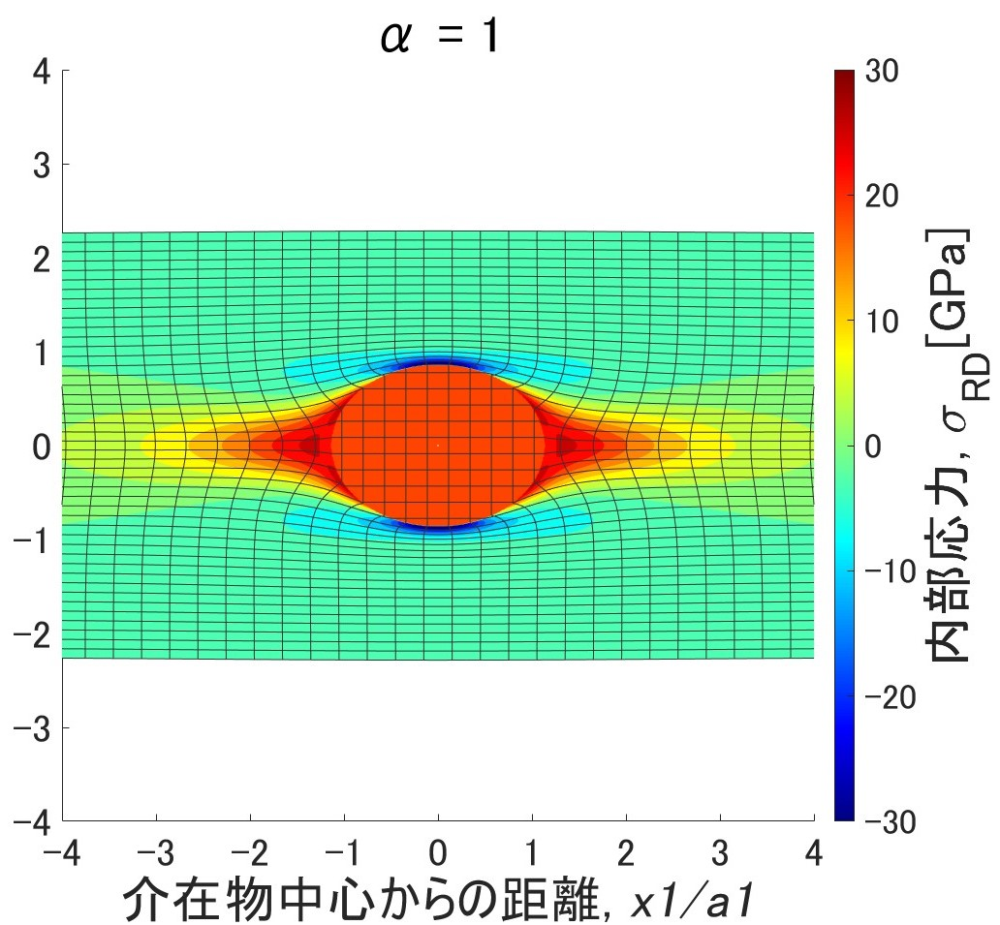
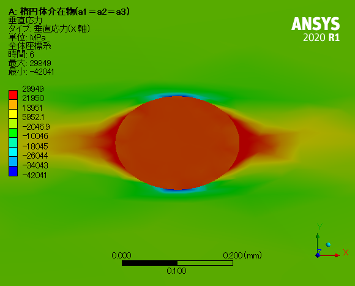

# 楕円体介在物解析

このプロジェクトでは、金属複合材料における楕円体介在物が内部応力場と応力緩和に与える影響をマイクロメカニクス解析を用いて検討します。特に、Eshelbyの等価介在物法を用いて、母相および介在物周辺の内部応力や変形形状を解析します。

<div style="display: flex; align-items: center; margin-top: 20px;">
  <div style="text-align: center;">
    <p>光学顕微鏡による観察</p>
    
  </div>
</div>

- **Deformation Zone**: 介在物周辺に形成される不均一な変形領域
- **Rotated Zone**: 格子回転が局所的に発生する領域で、再結晶挙動（PSN効果）に寄与

図1は、冷間圧延されたアルミニウム合金AA3003中のα-Al(Mn, Fe)Si粒子の周辺に形成されるdeformation zoneを光学顕微鏡で観察したものである[1]。この図は粒子のアスペクト比が異なる場合（(a) 1.0：球形、(b)(c) 2.0および4.0：長楕円体）を示しており、圧延方向に伴う粒子周辺の変形構造を比較している。

本プロジェクトでは、これらの変形領域の形成メカニズムを明らかにし、介在物形状が与える影響を定量的に予測することを目的としています。

## 特徴

- Eshelbyの等価介在物法を用いたマイクロメカニクス解析の実装
- 球形状および回転楕円体介在物に対する内部応力場と変形形状の検討

## 方法

### 応力解析
- 介在物と母相の塑性ひずみミスマッチをモデル化
- Eigenひずみのキャンセルすることで、応力緩和効果を解析

### シミュレーション設定

- 各種アスペクト比の介在物を対象とした解析（球、回転楕円体）
- Eigenひずみを希釈・再分布させることで塑性緩和領域をシミュレート

### 検証

- 有限要素法（FEA）および実験データとの比較による結果の妥当性を確認

出力のサンプルとして、以下にRD方向における応力分布の結果を載せます。
（条件: ヤング率比 = 3.0、ポアソン比 = 0.33、初期内部塑性ひずみ [-0.5, 0, 0.5, 0, 0, 0]、球形状介在物）

<div style="display: flex; align-items: center;">
  <div style="text-align: center; margin-right: 20px;">
    <p>マイクロメカニクス解析</p>
    
  </div>
  <div style="text-align: center; margin-left: 20px;">
    <p>有限要素解析</p>
    
  </div>
</div>


## 主な結果

- 介在物のアスペクト比が増加すると、応力や変形が局所化し、顕著になることを確認
- AA3003アルミニウム合金におけるDeformation Zoneの観察結果と整合性を確認
- 塑性領域の安定形状が特定され、観察されたRotated Zoneと類似

## 使用方法

### 必要条件

- Python 3.10以上
- `requirements.txt`に記載された依存ライブラリ

### インストール手順
1. リポジトリをクローン：
   ```bash
   git clone https://github.com/yourusername/ellipsoidal_inclusion_analysis.git
   ```
2. 依存ライブラリをインストール：
   ```bash
   pip install -r requirements.txt
   ```

### 実行手順
1. 設定ファイルで介在物のパラメータを設定
2. メインスクリプトを実行：
   ```bash
   python main.py
   ```
3. 結果は、出力ディレクトリにプロット画像およびデータファイルとして保存されます。

## プロジェクトの進捗状況

本プロジェクトは、大学院修士時代にMATLABで構築した数値解析プログラムを基にしています。
現在途中ではありますが、順次Pythonでの完全移植を目指しています。

## Pythonに移行している理由

MATLABからPythonに移行する理由は以下の通りです：

- **コストの削減**: MATLABは有償ライセンスが必要ですが、Pythonはオープンソースで無料のため、コスト負担を軽減できます。
- **汎用性の向上**: Pythonは多くの外部ライブラリやツールと連携できるため、プロジェクトの拡張性が高まります。
- **ポートフォリオとしての価値向上**: Pythonでの実装により、他の開発者や企業が評価しやすい形で成果物を公開できます。

## 参考文献

[1] Park, S.J. and Muraishi, S., 2021. Micromechanical analysis of residual stress around coarse
precipitates under cold rolling conditions. Mechanics of Materials, 157, p.103841.

